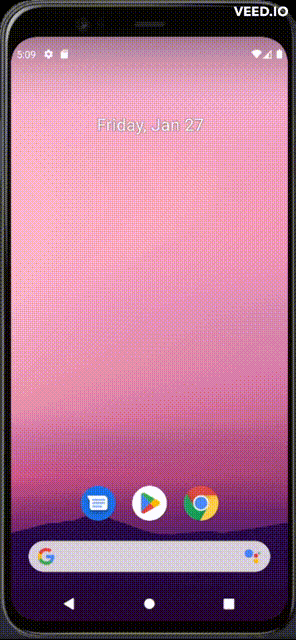

# AndroidStudio-RecyclerView

<details>

**<summary>Application Images</summary>**



</details>

## **Code**

<ul>

### <li>**Java files**

<ul>

<li>

<details>

**<summary>`MainActivity.java`</summary>**

```java
package com.example.androidstudio_recyclerview;

import androidx.appcompat.app.AppCompatActivity;
import androidx.recyclerview.widget.LinearLayoutManager;
import androidx.recyclerview.widget.RecyclerView;

import android.os.Bundle;
import android.view.View;

import java.util.LinkedList;

import com.google.android.material.floatingactionbutton.FloatingActionButton;

public class MainActivity extends AppCompatActivity {

    private RecyclerView mRecyclerView;
    private WordListAdapter mAdapter;

    private FloatingActionButton floatingActionButton;


    @Override
    protected void onCreate(Bundle savedInstanceState) {
        super.onCreate(savedInstanceState);
        setContentView(R.layout.activity_main);


        mRecyclerView = (RecyclerView) findViewById(R.id.recyclerview);

        LinkedList<String> mWordList = new LinkedList<String>();
        mWordList.add("Word 1");
        mWordList.add("Word 2");
        mWordList.add("Word 3");

        mAdapter = new WordListAdapter(this, mWordList);

        mRecyclerView.setAdapter(mAdapter);

        mRecyclerView.setLayoutManager(new LinearLayoutManager(this));


        this.floatingActionButton = findViewById(R.id.floatingActionButton);


        this.floatingActionButton.setOnClickListener(view -> {
            int itemCount = this.mAdapter.getItemCount() + 1;
            mWordList.add("Word " + itemCount);
            mRecyclerView.getAdapter().notifyItemInserted(itemCount);
            mRecyclerView.smoothScrollToPosition(itemCount);
        });

    }
}
```

</details>

</li>

<li>

<details>

**<summary>`WordListAdapter.java`</summary>**

```java
package com.example.androidstudio_recyclerview;


import android.content.Context;
import android.view.LayoutInflater;
import android.view.View;
import android.view.ViewGroup;
import android.widget.TextView;

import androidx.recyclerview.widget.RecyclerView;

import java.util.LinkedList;

public class WordListAdapter extends RecyclerView.Adapter<WordListAdapter.WordViewHolder> {


    private LayoutInflater mInflater;
    private LinkedList<String> mWordList;


    public WordListAdapter(Context context, LinkedList<String> wordList) {
        mInflater =
                LayoutInflater.from(context);
        this.mWordList = wordList;
    }


    @Override
    public WordViewHolder onCreateViewHolder(ViewGroup parent, int viewType) {
        View mItemView = mInflater.inflate(R.layout.items, parent, false);

        return new WordViewHolder(mItemView, this);
    }


    @Override
    public void onBindViewHolder(WordViewHolder holder, int position) {
        String mCurrent = mWordList.get(position);
        holder.wordItemView.setText(mCurrent);
    }


    @Override
    public int getItemCount() {
        return mWordList.size();
    }


    public static class WordViewHolder extends RecyclerView.ViewHolder implements View.OnClickListener {


        private final TextView wordItemView;


        public WordViewHolder(View itemView, WordListAdapter adapter) {


            super(itemView);
            wordItemView = (TextView) itemView.findViewById(R.id.word);
            itemView.setOnClickListener(this);
        }


        @Override
        public void onClick(View v) {
            wordItemView.setText("Clicked! " + wordItemView.getText());
        }

    }


}
```

</details>

</li>

</ul>

</li>

### <li>**XML files**

<ul>

#### <li>**`drawable`**

<ul>

<li>

<details>

**<summary>`ic_baseline_add_24.xml`</summary>**

```xml
<vector xmlns:android="http://schemas.android.com/apk/res/android"
    android:width="24dp"
    android:height="24dp"
    android:tint="#000000"
    android:viewportWidth="24"
    android:viewportHeight="24">
    <path
        android:fillColor="@android:color/white"
        android:pathData="M19,13h-6v6h-2v-6H5v-2h6V5h2v6h6v2z" />
</vector>
```

</details>

</li>

</ul>

</li>

#### <li>**`layout`**

<ul>

<li>

<details>

**<summary>`activity_main.xml`</summary>**

```xml
<?xml version="1.0" encoding="utf-8"?>
<androidx.constraintlayout.widget.ConstraintLayout xmlns:android="http://schemas.android.com/apk/res/android"
    xmlns:app="http://schemas.android.com/apk/res-auto"
    xmlns:tools="http://schemas.android.com/tools"
    android:layout_width="match_parent"
    android:layout_height="match_parent"
    tools:context=".MainActivity">


    <androidx.recyclerview.widget.RecyclerView
        android:id="@+id/recyclerview"
        android:layout_width="match_parent"
        android:layout_height="match_parent" />


    <com.google.android.material.floatingactionbutton.FloatingActionButton
        android:id="@+id/floatingActionButton"
        android:layout_width="wrap_content"
        android:layout_height="wrap_content"
        android:backgroundTint="@color/pink"
        android:clickable="true"
        app:layout_constraintBottom_toBottomOf="@+id/recyclerview"
        app:layout_constraintEnd_toEndOf="parent"
        app:srcCompat="@drawable/ic_baseline_add_24" />

</androidx.constraintlayout.widget.ConstraintLayout>
```

</details>

</li>

<li>

<details>

**<summary>`items.xml`</summary>**

```xml
<?xml version="1.0" encoding="utf-8"?>
<LinearLayout xmlns:android="http://schemas.android.com/apk/res/android"
    android:layout_width="match_parent"
    android:layout_height="wrap_content"
    android:orientation="vertical"
    android:padding="6dp">

    <TextView
        android:id="@+id/word"
        style="@style/word_title" />
</LinearLayout>
```

</details>

</li>

</ul>

#### <li>**`values`**

<ul>

<li>

<details>

**<summary>`colors.xml`</summary>**

```xml
<?xml version="1.0" encoding="utf-8"?>
<resources>
    <color name="purple_200">#FFBB86FC</color>
    <color name="purple_500">#FF6200EE</color>
    <color name="purple_700">#FF3700B3</color>
    <color name="teal_200">#FF03DAC5</color>
    <color name="teal_700">#FF018786</color>
    <color name="black">#FF000000</color>
    <color name="white">#FFFFFFFF</color>

    <color name="pink">#ffc0cb</color>

</resources>
```

</details>

</li>

<li>

<details>

**<summary>`styles.xml`</summary>**

```xml
<?xml version="1.0" encoding="utf-8"?>
<resources>

    <style name="word_title">
        <item name="android:layout_width">wrap_content</item>
        <item name="android:layout_height">wrap_content</item>
    </style>
</resources>
```

</details>

</li>

</ul>

</li>

#### <li>**`gradle`**

<ul>

<li>

<details>

**<summary>`build.gradle`</summary>**

```xml
plugins {
    id 'com.android.application'
}

android {
    namespace 'com.example.androidstudio_recyclerview'
    compileSdk 32

    defaultConfig {
        applicationId "com.example.androidstudio_recyclerview"
        minSdk 28
        targetSdk 32
        versionCode 1
        versionName "1.0"

        testInstrumentationRunner "androidx.test.runner.AndroidJUnitRunner"
    }

    buildTypes {
        release {
            minifyEnabled false
            proguardFiles getDefaultProguardFile('proguard-android-optimize.txt'), 'proguard-rules.pro'
        }
    }
    compileOptions {
        sourceCompatibility JavaVersion.VERSION_1_8
        targetCompatibility JavaVersion.VERSION_1_8
    }
}

dependencies {


    implementation 'androidx.appcompat:appcompat:1.5.1'
    implementation 'com.google.android.material:material:1.7.0'
    implementation 'androidx.constraintlayout:constraintlayout:2.1.4'
    testImplementation 'junit:junit:4.13.2'
    androidTestImplementation 'androidx.test.ext:junit:1.1.5'
    androidTestImplementation 'androidx.test.espresso:espresso-core:3.5.1'


    implementation 'androidx.recyclerview:recyclerview:1.2.1'
    implementation 'androidx.recyclerview:recyclerview-selection:1.1.0'

}
```

</details>

</li>

</ul>

</li>

</ul>

</li>

</ul>

</ul>
